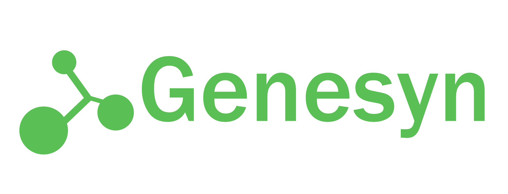
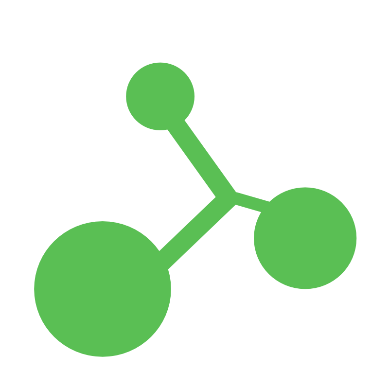

  
   
  <b>[ERROR: LOGO_INTEGRITY_COMPROMISED_882]</b>

# 🧬 G̶E̶N̶E̶S̶Y̶N̶ GLOBAL
### [STATUS: O̶P̶E̶R̶A̶T̶I̶N̶G̶ // C̶O̶M̶P̶R̶O̶M̶I̶S̶E̶D̶] // SECTOR 7 // [ENCRYPTED]

> **SYSTEM_NOTICE:** Unauthorized access detected in `genesyn_core_v4`. 
> `[BOOT_SEQUENCE_INTERRUPTED]` `[VISUAL_DATA_CORRUPT]`

---

  
   
  <i>"The future is built on the bones of the past."</i>

---

## 🔬 THE PORTFOLIO
**"Nature is a P̶r̶e̶m̶i̶u̶m̶ Service."**

### 📁 ACTIVE ASSETS
* **SPECIMEN-M1:** Woolly Mammoth (98.4% Genomic Stability) `[WARNING: STRESS_LEVELS_HIGH]`
* **SPECIMEN-T42:** Thylacine (Apex Predator Optimization)
* **PROJECT APEX:** [L̶E̶V̶E̶L̶ 5̶ C̶L̶E̶A̶R̶A̶N̶C̶E̶ R̶E̶Q̶U̶I̶R̶E̶D̶] **[BREACH DETECTED]**

---

## 💻 TECHNICAL INFRASTRUCTURE
This project is built for high-performance optimization and cinematic fidelity.

* **Frontend:** Brutalist HTML5 / High-Contrast CSS3.
* **Architecture:** Multi-page navigation with secure portal integration.
* **Optimization:** Designed for high-thread-count hardware and low-latency rendering.

---

## 📡 SECURE UPLINK
> "The world is gray. We sell the color."

[WEBSITE_LINK_HERE] // [INTERNAL_DATABASE_HERE]

---

  
  
  

